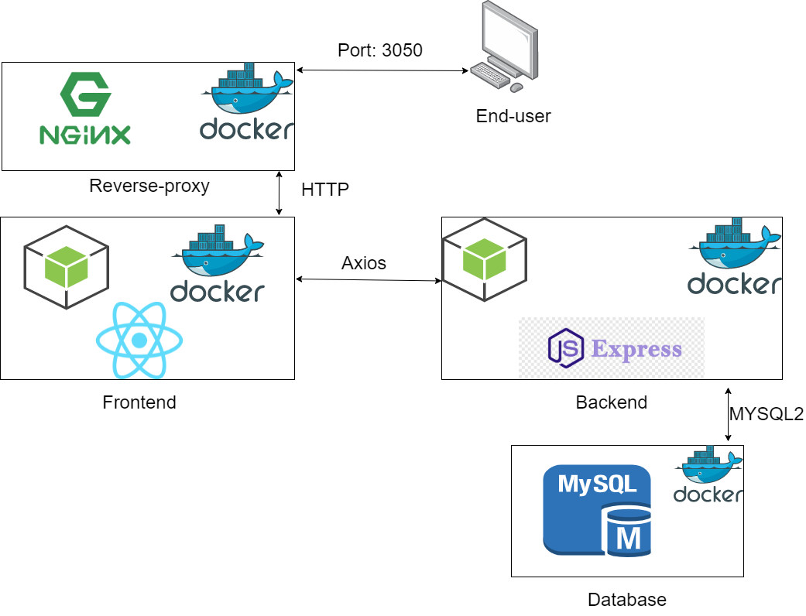

# Dashboard to estimate fares

This dashboard will help the customers to estimate the fares before requesting
a ride. The dashboard will let the user select 2 locations: pick-up and drop-off.
Depending on the day, hour and distance, the user will recieve a diferent price.

# Tech stack

- Docker: Automatization and orchestation of the application
- Nginx: Web server
- MYSQL: Database
- Express: Backend microframework
- NodeJS: Runtime
- React: Javascript library for the frontend

# What you need to run this project

- [Docker](https://docs.docker.com/get-docker/)
- [Node](https://nodejs.org/es/download/)

# Infrastructure



# Project structure

    ```
    .
    ├── esimation_fare_dashboard
    │   ├── public
    │   ├── src
    │   ├── Dockerfile
    │
    ├── nginx
    │   ├── default.conf
    │   ├── Dockerfile
    │
    ├── server
    │    ├── fare.js
    │    ├── index.js
    │    ├── surgePricing.js
    │    ├── Dockerfile
    ├── docker-compose.yml
    ```

# How to run the project?

1. Download the repo

   ```
   git clone https://github.com/caposcar1998/estimationFares.git
   ```

2. Run from the root of the project:

   ```
   docker-compose up --build
   ```

3. Open port [3050](http://localhost:3050)

# Access the database

1. Run the previous steps

2. To access the dashboard open [8000](http://localhost:8000/)

3. User the credentials:

   - Username: root
   - Password: MYSQL_ROOT_PASSWORD

4. Access beat database

5. Create table : locations with the following attributes:

   - name: text
   - latitude: float
   - longitude: float
   - id: int (autoincrement)

6. Add the values that you want

### Note: The project needs data in the database so it can work, please add the values given in the CSV manually

# Testing

1. Access server directory

2. Run:

   ```
   npm i
   ```

3. Run:

   ```
   npm test
   ```

# Endpoints

## Locations

Retrieve all the locations information

- GET : /locations

## Distance

Get the price of the ride

- POST : /locations/distance

  ```
  body : {
      "locationOne":{
          "latitude":-12.0672843,
          "longitude":-77.0359179
      },
      "locationTwo":{
          "latitude":-12.0859979,
          "longitude":-76.9786166

      }
  }
  ```

# Get the distance between two points on earth

It was used the harvesine formula, for more info please refeer to [harvesine formula](https://www.geeksforgeeks.org/program-distance-two-points-earth/)
